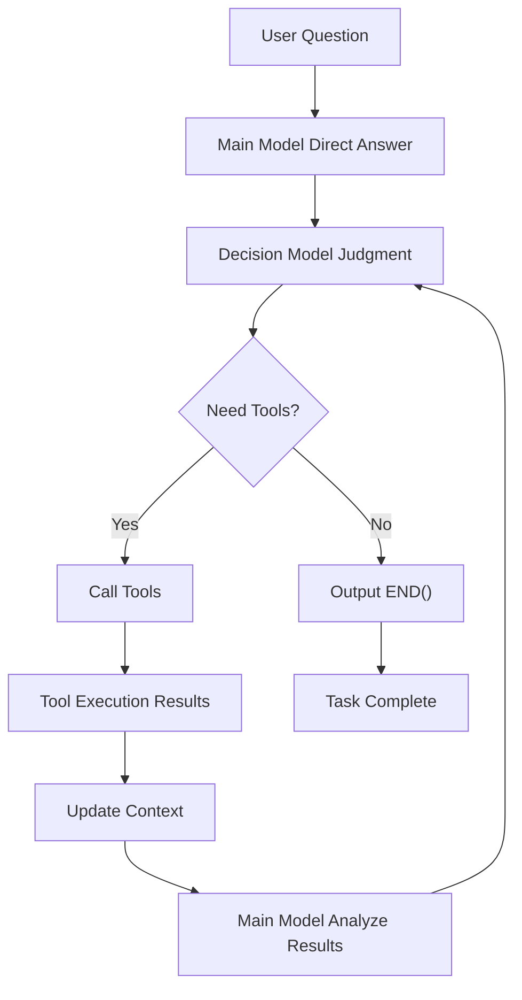

# EchoAgent - Agent Framework

<div align="center">


**Answer First, Then Decide Agent Framework | 先回答，再决策的智能体框架**

[🇺🇸 English](#english) • [🇨🇳 中文](README_CN.md)

[Quick Start](#-quick-start) • [Features](#-core-features) • [Architecture](#%EF%B8%8F-architecture-design) • [Documentation](#-usage-guide) • [Contributing](#-contributing)

</div>

---

## English

### 📖 Project Overview

EchoAgent is an innovative agent framework that adopts a unique "**Answer First-Judge-Tool Calling-END() Termination**" mechanism. Unlike traditional approaches that call tools before answering, EchoAgent lets the main model first directly answer user questions based on existing knowledge, then uses a decision model to determine whether tools need to be called for further processing.

### 🌟 Core Features

- **🔄 Dual Model Collaboration**: Main model handles answers, decision model handles tool calling judgments
- **⚡ Rapid Response**: Provides direct answers first, then processes deeply as needed
- **🛡️ Safe Execution**: Built-in code executor with secure Python code execution
- **🔧 Tool Ecosystem**: Rich toolset supporting document processing, data analysis, web search, and enhanced ArXiv paper retrieval with batch processing and resume functionality
- **📊 Persistent Context**: Cross-conversation variable persistence, supporting continuous data analysis tasks
- **🔄 Context Separation**: Smart separation between agent conversation context and code execution context, preventing variable pollution while maintaining code persistence
- **🎯 Intelligent Termination**: Smart task completion judgment through `END()` signals
- **🖼️ Headless Plotting**: CodeRunner enforces Matplotlib Agg backend to avoid Tkinter thread errors; prefer `plt.savefig(...)` over `plt.show()` in headless runs

### 🏗️ Architecture Design



#### Core Components

- **AgentConfig**: Configuration management, supporting multi-user, multi-model
- **AgentStateManager**: State management, handling conversation history and file storage
- **AgentToolManager**: Tool management, unified registration and calling of local/remote tools
- **LLMManager**: LLM management, supporting various LLM providers
- **CodeExecutor**: Safe code executor with persistent context support

### 🚀 Quick Start

#### Requirements

- Python 3.8+
- Supported LLM provider API keys (Doubao, OpenAI, Claude, etc.)

#### Installation Steps

1. **Clone Repository**
```bash
git clone https://github.com/JNUZXF/EchoAgent.git
cd EchoAgent
```

2. **Create and Activate Virtual Environment**
```bash
# Windows (PowerShell)
python -m venv venv
./venv/Scripts/Activate.ps1

# macOS/Linux (bash)
python3 -m venv venv
source venv/bin/activate
```

3. **Install Dependencies**
```bash
pip install -r requirements.txt  # Need to create this file
```

4. **Configure Environment Variables**
```bash
# Copy environment template
cp .env.example .env

# Edit .env file, add your API keys
DOUBAO_API_KEY=your_doubao_api_key
OPENAI_API_KEY=your_openai_api_key
# More configurations...
```

5. **Run Example**
```bash
python agent_frame.py
```

#### Basic Usage

```python
from agent_frame import EchoAgent, AgentConfig

# Create configuration
config = AgentConfig(
    user_id="demo_user",
    main_model="doubao-pro",
    tool_model="doubao-pro", 
    flash_model="doubao-pro"
)

# Initialize agent
agent = EchoAgent(config)

# Start conversation
await agent.chat_loop()
```

### 📚 Usage Guide

#### Tool System (Pydantic + @tool)

We upgraded the tool system to use Pydantic-based schemas and a unified ToolRegistry. Define your tool as a function decorated with `@tool` and a Pydantic parameter model; the framework auto-generates JSON Schemas and executes tools with validated arguments.

Quick example:

```python
from pydantic import BaseModel, Field
from tools_agent.toolkit import tool

class MyToolArgs(BaseModel):
    question: str = Field(..., description="User question with context")

@tool
def my_tool(args: MyToolArgs):
    return {"echo": args.question}
```

Register it in `agent_frame.py` inside `_register_local_tools`:

```python
from tools_agent.my_tools import my_tool
self.tool_manager.register_tool_function(my_tool)
```

The schema will be included automatically in prompts; execution is routed via `ToolRegistry` with strict validation.

#### Code Execution Context Management

The framework provides intelligent separation between agent conversation context and code execution persistence:

**Built-in Code Tools:**
- **CodeRunner**: Execute Python code with persistent variable context
- **ViewCodeContext**: Inspect current persistent variables
- **ResetCodeContext**: Clear code execution context when needed

**Key Benefits:**
- **Clean Conversations**: Agent conversations show execution summaries, not detailed variable dumps
- **Code Persistence**: Variables persist across multiple code executions for iterative development
- **Context Control**: Users can inspect and reset code context as needed

**Example Usage:**
```python
# First execution - creates variables
CodeRunner({"code": "import pandas as pd\ndf = pd.DataFrame({'A': [1,2,3]})"})
# Returns: {'success': True, 'result_summary': 'DataFrame (shape: (3, 1))', 'persistent_variables_count': 2}

# Second execution - uses previous variables  
CodeRunner({"code": "df['B'] = [4,5,6]\nprint(df)"})
# Variables 'pd' and 'df' are still available from previous execution

# Check what variables are available
ViewCodeContext({"show_details": True})
# Returns: {'variables': {'pd': 'module', 'df': {'type': 'DataFrame', 'info': 'shape: (3, 2)'}}}

# Reset when starting fresh
ResetCodeContext({"confirm": True})
# Clears all persistent variables
```

### ✅ Architecture Slimming & Pydantic Integration (2025-09-10)

- Added `ToolEventModel`, `IntentionResultModel`, and `TeamContextModel` (Pydantic) to standardize validation/serialization
- Unified `_create_tool_event` and kept the legacy `[[TOOL_EVENT]]` envelope unchanged for frontend compatibility
- TeamContext read/write now validated and merged via model; gracefully falls back to dict if validation fails

See details in `docs/工具集成优化.md`.

### 🔄 Recent Fixes (2025-09-10)

- Windows 原子写覆盖修复：`core/safe_state_manager.py` 与 `core/cache_manager.py` 将临时文件落盘后的 `rename` 改为 `replace`，避免 `WinError 183`。
- 聊天主流程进入修复：`agent_frame_v6_optimized.py` 在 `process_query` 开始执行 `_agent_reset()` 注入系统提示后再加入用户问题，确保主模型上下文完整；修正意图占位符并增强解析鲁棒性。
- 文档新增：详见 `docs/v6优化修复说明与使用指南.md` 获取详细说明与使用建议。
- CodeRunner stale code fix: `agent_frame_v5.py` now updates the latest assistant message after each tool+analysis cycle and extracts code for the next `CodeRunner` run from that message. This prevents repeating old errors even after code has been corrected. See `docs/CodeRunner重复错误修复说明.md`.

### 📚 Enhanced ArXiv Paper Retrieval

The framework includes a robust ArXiv paper retrieval system with the following improvements:

#### Key Features
- **🔄 Batch Processing**: Handles large-scale searches (1000+ papers) by splitting into manageable batches
- **💾 Resume Functionality**: Automatic progress saving and resume capability for interrupted searches
- **🛡️ Error Handling**: Enhanced retry mechanisms and API limit management
- **📊 Detailed Logging**: Comprehensive logging with file output for debugging
- **🎯 Multi-field Search**: Support for title, author, abstract, and category-based searches

#### Usage Example
```python
from agent_cases.research_agent.arxiv_search import ArxivSearcher, SearchField

# Initialize with batch processing
searcher = ArxivSearcher(
    download_dir="./arxiv_papers", 
    max_workers=3,
    batch_size=500  # Process 500 papers per batch
)

# Large-scale search with resume capability
papers, stats = searcher.search_and_download(
    query="agent",
    search_field=SearchField.TITLE,
    search_num=3000,  # Can handle thousands of papers
    sort_by=arxiv.SortCriterion.LastUpdatedDate,
    download=False  # Search first, download later
)

# Resume interrupted search
if searcher.progress_file.exists():
    papers = searcher.resume_search()
```

#### Improvements Made
- **API Limit Management**: Increased delays and smaller batch sizes to avoid ArXiv API restrictions
- **Progress Persistence**: Automatic saving of search progress with JSON-based recovery
- **Enhanced Error Recovery**: Multiple retry strategies for different types of failures
- **Intelligent Batching**: Adaptive batch sizing based on API responses

### Extending Development

#### Adding Custom Tools

1. **Create Tool Class**
```python
class MyTool:
    def execute(self, **kwargs):
        # Tool logic
        return result
```

2. **Register Tool**
```python
agent.tool_manager.register_local_tool(
    "my_tool", 
    MyTool(), 
    tool_config_for_prompt
)
```

3. **Update Tool Configuration**
Add tool description in `tools_configs.py`.

### 🔧 Configuration

#### Model Configuration

Supports multiple LLM providers:

```python
# Doubao Series
"doubao-pro", "doubao-1.5-lite", "doubao-1.5-pro-256k"

# OpenAI Series  
"gpt-4o", "gpt-4o-mini"

# Claude Series
"anthropic/claude-3.5-sonnet"

# Open Source Models
"opensource/llama-3.1-8b"
```

#### Security Configuration

CodeExecutor supports three security levels:
- `strict`: Only allows basic standard libraries
- `medium`: Allows common scientific computing libraries (default)
- `permissive`: Allows most libraries, only prohibits dangerous operations

### 📁 Project Structure

```
EchoAgent/
├── agent_frame_v6.py      # Main agent workflow (entry for v6)
├── agent_core/            # Core modularized components
│   ├── __init__.py        # Re-exports common classes
│   ├── models.py          # ToolEventModel, IntentionResultModel, TeamContextModel
│   ├── state_manager.py   # AgentStateManager
│   ├── tools.py           # LocalToolManager, AgentToolManager
│   └── prompts.py         # AgentPromptManager
├── config/                # Config management
│   ├── __init__.py        # exports AgentSettings, create_agent_config
│   └── agent_config.py
├── prompts/               # Prompt templates
│   └── agent_prompts.py
├── tools_agent/           # Tool implementations & registry
│   ├── llm_manager.py     # LLM management
│   └── ...
├── utils/                 # Utilities (code runner, file manager, etc.)
│   ├── code_runner.py
│   └── ...
├── docs/                  # Guides and architecture notes
├── files/                 # User/session data storage
├── workspaces/            # Multi-project/team isolation (optional)
└── requirements.txt
```

### 📁 File & Session Management

EchoAgent automatically creates a session-scoped directory on each agent start, organizing all artifacts and logs in a structured, production-ready way.

- Root directory: `files/` by default, configurable via `AGENT_FILES_ROOT`
- Layout per session: `files/{user_id}/{agent_name}/{session_id}/`
- Subfolders: `logs/`, `conversations/`, `artifacts/`, `uploads/`, `outputs/`, `temp/`
  and `images/`
- Convenience pointer: `files/{user_id}/{agent_name}/latest.json` stores latest `session_id`

See detailed guide: [docs/FileManagement.md](docs/FileManagement.md)

Tip: To isolate multi-project work or enable team spaces, pass `workspace` when constructing `AgentConfig`. When set, all sessions and artifacts are stored under `workspaces/{user}/{workspace}/{agent}` instead of `files/...`. Details: [Workspace mode](docs/FileManagement.md#workspace-工作空间模式多项目多团队隔离)

### 🧩 Modular Core (2025-09-10)

- Introduced `agent_core/` package and moved core classes out of `agent_frame_v6.py`:
  - `models.py`: ToolEventModel, IntentionResultModel, TeamContextModel
  - `state_manager.py`: AgentStateManager
  - `tools.py`: LocalToolManager, AgentToolManager
  - `prompts.py`: AgentPromptManager
- Backward compatibility kept: tool event envelope `[[TOOL_EVENT]]{...}` unchanged.
- How to import now:
```python
from agent_core import (
  AgentStateManager, AgentToolManager, AgentPromptManager,
  ToolEventModel, IntentionResultModel, TeamContextModel,
)
```

See: `docs/Agent模块化重构.md`.

### 🧾 Production-grade Logging

EchoAgent persists rich, structured logs per session under `files/{user_id}/{agent_name}/{session_id}/logs/`:

- `agent.log`: Rotating rich text logs (INFO+ console, DEBUG+ file)
- `error.log`: Rotating error-only logs for quick incident triage
- `events.jsonl`: Structured JSON logs, one event per line, suitable for downstream analysis

Each log record includes contextual fields: `user_id`, `agent_name`, `session_id`. Key lifecycle events are captured: session init, user questions, LLM streaming phases, tool start/end, errors, and completion timing. Conversation records are stored under `conversations/` as `conversations.json`, `display_conversations.md`, `full_context_conversations.md`, and `tool_conversations.json`.

Environment variables to tune behavior:

```bash
# Logging location follows AGENT_FILES_ROOT; defaults to project_root/files
AGENT_LOG_MAX_BYTES=5242880      # per file max size, default 5MB
AGENT_LOG_BACKUP=5               # rotated file count, default 5
AGENT_LOG_CONSOLE_LEVEL=INFO     # console level, default INFO
AGENT_LOG_FILE_LEVEL=DEBUG       # file level, default DEBUG
```

Example path:

```
files/ada/echo_agent/20250903-225827-432428/logs/
├── agent.log
├── agent.log.1
├── error.log
└── events.jsonl
```

## 🤝 Contributing

We welcome all forms of contributions! Please check [CONTRIBUTING.md](CONTRIBUTING.md) for detailed guidelines.

### Ways to Contribute

1. **Report Issues**: Use [Issue templates](.github/ISSUE_TEMPLATE/) to report bugs
2. **Feature Suggestions**: Submit feature requests and improvement suggestions  
3. **Code Contributions**: Fork the project, create branches, submit PRs
4. **Documentation Improvements**: Improve documentation and examples

### Development Environment Setup

```bash
# Install development dependencies
pip install -r requirements-dev.txt

# Run tests
python -m pytest tests/

# Code formatting
black agent_frame.py
```

## 📋 TODO

Check [ToDo.md](ToDo.md) for current optimization plans and claimable tasks.

## 🐛 Troubleshooting

### Common Issues

**Q: Tool calling fails?**
A: Check detailed logs in `files/{user_id}/{agent_name}/tool_conversations.json`.

**Q: Code execution timeout?**
A: Adjust the `timeout` parameter in `CodeExecutor`, or check code complexity.

**Q: API call failures?**
A: Confirm API key configuration in `.env` file is correct.

**Q: Tkinter errors after running plotting code via CodeRunner?**
A: CodeRunner runs in a background thread and enforces a headless backend (Agg). Do not call `plt.show()`. Save figures using `plt.savefig(...)`. More: `docs/CodeRunner图形后端修复说明.md`.

### View Logs

```bash
# View complete conversation history
cat files/{user_id}/{agent_name}/full_context_conversations.md

# View tool execution logs
cat files/{user_id}/{agent_name}/tool_conversations.json
```

## 📄 License

This project is licensed under the [MIT License](LICENSE).

## 🙏 Acknowledgments

Thanks to the following projects and communities for their support:
- [LangChain](https://github.com/langchain-ai/langchain) - Inspired tool chain design
- [OpenAI](https://openai.com/) - API support
- [ByteDance](https://www.volcengine.com/) - Doubao model support

## 📞 Contact Us

- Submit Issues: [GitHub Issues](https://github.com/JNUZXF/EchoAgent/issues)
- Email: [Please add your email]
- WeChat: 

---

<div align="center">

**⭐ If this project helps you, please give us a star!**

[⬆ Back to Top](#echoagent---agent-framework)

</div>