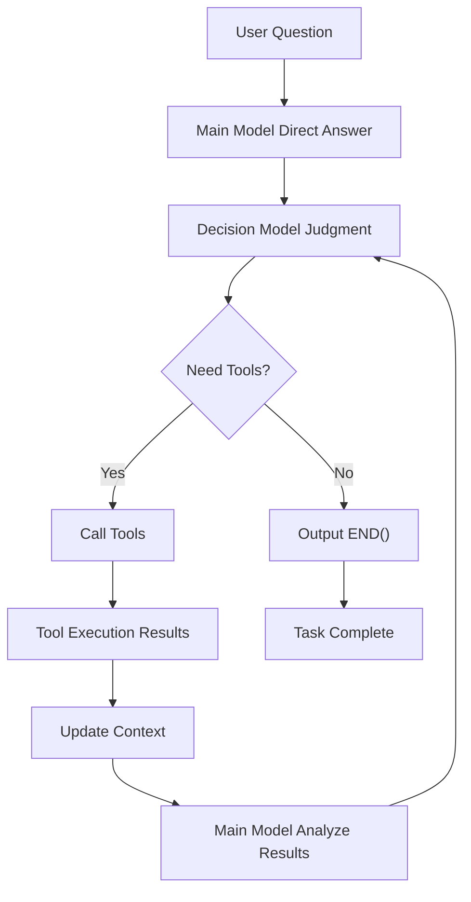

# EchoAgent - Agent Framework

<div align="center">


**Answer First, Then Decide Agent Framework | 先回答，再决策的智能体框架**

[🇺🇸 English](#english) • [🇨🇳 中文](README_CN.md)

[Quick Start](#-quick-start) • [Features](#-core-features) • [Architecture](#%EF%B8%8F-architecture-design) • [Documentation](#-usage-guide) • [Contributing](#-contributing)

</div>

---

## English

### 📖 Project Overview

EchoAgent is an innovative agent framework that adopts a unique "**Answer First-Judge-Tool Calling-END() Termination**" mechanism. Unlike traditional approaches that call tools before answering, EchoAgent lets the main model first directly answer user questions based on existing knowledge, then uses a decision model to determine whether tools need to be called for further processing.

### 🌟 Core Features

- **🔄 Dual Model Collaboration**: Main model handles answers, decision model handles tool calling judgments
- **⚡ Rapid Response**: Provides direct answers first, then processes deeply as needed
- **🛡️ Safe Execution**: Built-in code executor with secure Python code execution
- **🔧 Tool Ecosystem**: Rich toolset supporting document processing, data analysis, web search, etc.
- **📊 Persistent Context**: Cross-conversation variable persistence, supporting continuous data analysis tasks
- **🎯 Intelligent Termination**: Smart task completion judgment through `END()` signals

### 🏗️ Architecture Design



#### Core Components

- **AgentConfig**: Configuration management, supporting multi-user, multi-model
- **AgentStateManager**: State management, handling conversation history and file storage
- **AgentToolManager**: Tool management, unified registration and calling of local/remote tools
- **LLMManager**: LLM management, supporting various LLM providers
- **CodeExecutor**: Safe code executor with persistent context support

### 🚀 Quick Start

#### Requirements

- Python 3.8+
- Supported LLM provider API keys (Doubao, OpenAI, Claude, etc.)

#### Installation Steps

1. **Clone Repository**
```bash
git clone https://github.com/JNUZXF/EchoAgent.git
cd EchoAgent
```

2. **Install Dependencies**
```bash
pip install -r requirements.txt  # Need to create this file
```

3. **Configure Environment Variables**
```bash
# Copy environment template
cp .env.example .env

# Edit .env file, add your API keys
DOUBAO_API_KEY=your_doubao_api_key
OPENAI_API_KEY=your_openai_api_key
# More configurations...
```

4. **Run Example**
```bash
python agent_frame.py
```

#### Basic Usage

```python
from agent_frame import Agent, AgentConfig

# Create configuration
config = AgentConfig(
    user_id="demo_user",
    main_model="doubao-pro",
    tool_model="doubao-pro", 
    flash_model="doubao-pro"
)

# Initialize agent
agent = Agent(config)

# Start conversation
await agent.chat_loop()
```

### 📚 Usage Guide

#### Tool System

EchoAgent includes various built-in tools:

**CodeRunner - Code Executor**
```python
# User: Help me calculate the first 10 Fibonacci numbers
# AI will answer directly, then automatically call CodeRunner to execute code
```

**Document Processing Tools**
- PDF reading and conversion
- Document vectorization and retrieval
- Image processing and OCR

**Data Analysis Tools**
- Stock data retrieval
- Financial report analysis
- Data visualization

### Extending Development

#### Adding Custom Tools

1. **Create Tool Class**
```python
class MyTool:
    def execute(self, **kwargs):
        # Tool logic
        return result
```

2. **Register Tool**
```python
agent.tool_manager.register_local_tool(
    "my_tool", 
    MyTool(), 
    tool_config_for_prompt
)
```

3. **Update Tool Configuration**
Add tool description in `tools_configs.py`.

### 🔧 Configuration

#### Model Configuration

Supports multiple LLM providers:

```python
# Doubao Series
"doubao-pro", "doubao-1.5-lite", "doubao-1.5-pro-256k"

# OpenAI Series  
"gpt-4o", "gpt-4o-mini"

# Claude Series
"anthropic/claude-3.5-sonnet"

# Open Source Models
"opensource/llama-3.1-8b"
```

#### Security Configuration

CodeExecutor supports three security levels:
- `strict`: Only allows basic standard libraries
- `medium`: Allows common scientific computing libraries (default)
- `permissive`: Allows most libraries, only prohibits dangerous operations

### 📁 Project Structure

```
EchoAgent/
├── agent_frame.py          # Main framework entry
├── prompts/               # Prompt management
│   └── agent_prompts.py
├── tools_agent/           # Tool collection
│   ├── llm_manager.py     # LLM management
│   ├── code_interpreter.py
│   └── ...
├── utils/                 # Tool implementation
│   ├── code_runner.py     # Code executor
│   └── ...
├── tools_configs.py       # Tool configuration
├── ToDo.md               # Optimization checklist
└── files/                # User data storage
```

## 🤝 Contributing

We welcome all forms of contributions! Please check [CONTRIBUTING.md](CONTRIBUTING.md) for detailed guidelines.

### Ways to Contribute

1. **Report Issues**: Use [Issue templates](.github/ISSUE_TEMPLATE/) to report bugs
2. **Feature Suggestions**: Submit feature requests and improvement suggestions  
3. **Code Contributions**: Fork the project, create branches, submit PRs
4. **Documentation Improvements**: Improve documentation and examples

### Development Environment Setup

```bash
# Install development dependencies
pip install -r requirements-dev.txt

# Run tests
python -m pytest tests/

# Code formatting
black agent_frame.py
```

## 📋 TODO

Check [ToDo.md](ToDo.md) for current optimization plans and claimable tasks.

## 🐛 Troubleshooting

### Common Issues

**Q: Tool calling fails?**
A: Check detailed logs in `files/{user_id}/{agent_name}/tool_conversations.json`.

**Q: Code execution timeout?**
A: Adjust the `timeout` parameter in `CodeExecutor`, or check code complexity.

**Q: API call failures?**
A: Confirm API key configuration in `.env` file is correct.

### View Logs

```bash
# View complete conversation history
cat files/{user_id}/{agent_name}/full_context_conversations.md

# View tool execution logs
cat files/{user_id}/{agent_name}/tool_conversations.json
```

## 📄 License

This project is licensed under the [MIT License](LICENSE).

## 🙏 Acknowledgments

Thanks to the following projects and communities for their support:
- [LangChain](https://github.com/langchain-ai/langchain) - Inspired tool chain design
- [OpenAI](https://openai.com/) - API support
- [ByteDance](https://www.volcengine.com/) - Doubao model support

## 📞 Contact Us

- Submit Issues: [GitHub Issues](https://github.com/JNUZXF/EchoAgent/issues)
- Email: [Please add your email]
- WeChat Group: [Please add QR code]

---

<div align="center">

**⭐ If this project helps you, please give us a star!**

[⬆ Back to Top](#echoagent---agent-framework)

</div>